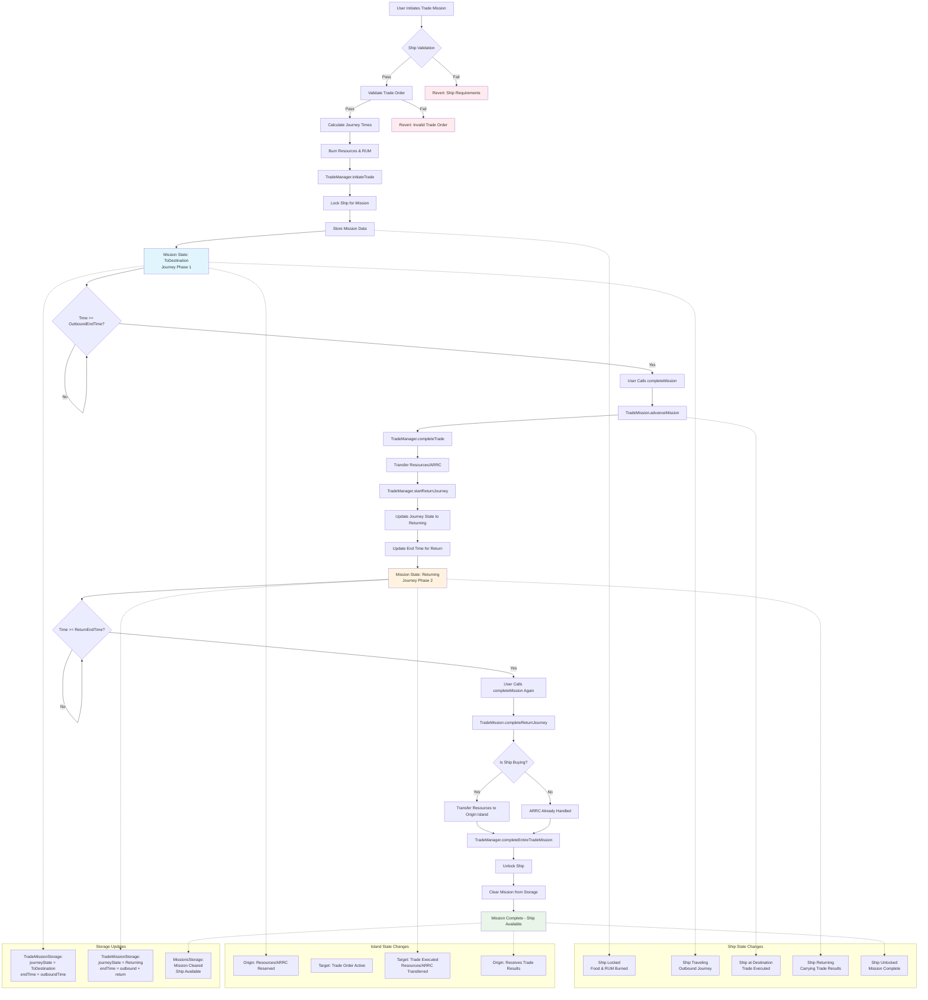

# TradeMission Technical Flow Documentation

## Overview

The TradeMission system implements a two-phase journey mechanism where ships travel from an origin island to a destination island to execute trades, then return with the trade results. This document explains the complete technical flow from both ship and island perspectives.

## Visual Flow Diagram

See `trade-mission-flow.mermaid` for the complete visual representation of the flow.



## Phase 1: Mission Initialization & Validation

### Ship Perspective:
1. **Ship Staking**: Ship must be staked with a captain and crew via `ShipAndPirateStaking`
2. **Resource Preparation**: Ship loads food (citrus/fish) for the journey via `ShipStorage`
3. **Token Approval**: User approves RUM tokens for burning and ARRC for potential fees

### Island Perspective:
1. **Trade Order Setup**: Target island must have an active trade order in `TradeManager`
2. **Resource Availability**: Ship owner must have sufficient resources/ARRC for the trade

### Validation Steps:
```solidity
// Ship validation
require(shipAndPirateStaking.isShipStaked(shipId), "Ship not staked");
require(!missionsStorage.isOnMission(shipId), "Ship already on mission");

// Trade order validation
require(tradeManager.isTradeOrderActive(tradeOrderId), "Invalid trade order");

// Resource type validation
require(resourceTypeManager.isValidResourceType(resourceType), "Invalid resource type");
```

## Phase 2: Mission Start & Resource Burning

### Ship Operations:
1. **Journey Time Calculation**: 
   - Outbound time calculated via `MissionTravelCalculator`
   - Return time calculated and stored for later use
2. **Resource Burning**:
   - RUM burned based on crew count and travel days
   - Food consumed from ship storage (citrus + fish)
3. **Ship Locking**: Ship locked for mission via `MissionsStorage.startMission()`

### Trade Operations:
1. **Trade Initiation**: `TradeManager.initiateTrade()` called
2. **Resource Transfer**: If selling, resources moved from ship owner to escrow
3. **ARRC Handling**: If buying, ARRC tokens prepared for trade execution

### Storage Updates:
```solidity
// TradeMissionStorage
missionData[missionId] = TradeMissionData({
    shipId: shipId,
    originIslandId: originIslandId,
    targetIslandId: targetIslandId,
    resourceType: resourceType,
    amount: amount,
    price: price,
    tradeOrderId: tradeOrderId,
    journeyState: JourneyState.ToDestination,
    returnJourneyDuration: returnTime,
    isShipBuying: isShipBuying,
    endTime: block.timestamp + outboundTime
});
```

## Phase 3: Outbound Journey (ToDestination State)

### Ship State:
- **Status**: Locked to mission, traveling to destination
- **Duration**: Based on distance between islands and ship speed
- **Validation**: Cannot start new missions or be unstaked

### Trade State:
- **Ship Owner**: Resources/ARRC reserved in escrow via TradeManager
- **Target Island**: Trade order remains active, awaiting ship arrival

### Time Progression:
- Mission remains in `ToDestination` state until `block.timestamp >= endTime`
- User can call `completeMission()` once outbound journey time has elapsed

## Phase 4: Trade Execution & Return Journey Start

### When `completeMission()` is called and time >= outbound end time:

1. **Trade Execution**:
   ```solidity
   // TradeMission.advanceMission()
   tradeManager.completeTrade(tradeOrderId, shipId);
   ```

2. **Resource/ARRC Transfer**:
   - If ship is buying: ARRC transferred to seller, resources to ship
   - If ship is selling: Resources transferred to buyer, ARRC to ship owner

3. **Return Journey Setup**:
   ```solidity
   // Update state to Returning
   tradeMissionStorage.updateJourneyState(missionId, JourneyState.Returning);
   
   // Update end time for return journey
   uint256 newEndTime = block.timestamp + returnJourneyDuration;
   tradeMissionStorage.updateEndTime(missionId, newEndTime);
   ```

4. **Event Emission**:
   ```solidity
   emit TradePhaseCompleted(missionId, shipId, JourneyState.ToDestination);
   ```

## Phase 5: Return Journey (Returning State)

### Ship State:
- **Status**: Carrying trade results, traveling back to origin
- **Cargo**: 
  - If buying: Newly acquired resources
  - If selling: ARRC tokens from sale
- **Duration**: Return journey time (usually same as outbound)

### Island State:
- **Target**: Trade completed, order potentially fulfilled
- **Origin**: Awaiting ship's return with trade results

### Storage State:
```solidity
// Mission state updated
journeyState = JourneyState.Returning
endTime = originalStartTime + outboundTime + returnTime
```

## Phase 6: Mission Completion & Resource Distribution

### When `completeMission()` is called and time >= return end time:

1. **Return Journey Completion**:
   ```solidity
   // TradeMission.completeReturnJourney()
   if (isShipBuying) {
       // Transfer acquired resources to origin island
       islandStorage.addResource(originIslandId, shipOwner, resourceType, amount);
   }
   // ARRC already handled during trade execution
   ```

2. **Mission Finalization**:
   ```solidity
   // TradeManager callback
   tradeManager.completeEntireTradeMission(missionId, shipId);
   
   // Unlock ship
   unlockShipAfterMission(shipId);
   missionsStorage.completeMission(shipId);
   ```

3. **Final State**:
   - Ship unlocked and available for new missions
   - Trade results delivered to origin island
   - Mission data preserved in storage for history

## Key Technical Components

### State Management:
- **JourneyState Enum**: `ToDestination(1)` → `Returning(3)` → `Completed(4)`
- **Time Tracking**: Separate outbound and return journey durations
- **Resource Tracking**: Escrow during trade, final distribution on completion

### Error Handling:
- **Ship Validation**: Prevents double-missions and invalid ship states
- **Ship Ownership**: Ensures only ship owners can initiate trades with their ships
- **Trade Order Validation**: Prevents trades on inactive/invalid orders
- **Time Validation**: Prevents premature mission advancement

### Integration Points:
- **TradeManager**: Handles trade order execution and resource/ARRC transfers
- **MissionsStorage**: Manages ship locking and mission state
- **TradeMissionStorage**: Stores specialized trade mission data
- **ShipStorage**: Manages ship cargo and food consumption
- **IslandStorage**: Handles island resource management

## Security Considerations

1. **Reentrancy Protection**: All external calls use proper checks-effects-interactions pattern
2. **Access Control**: Only ship owners can manage their missions
3. **State Validation**: Comprehensive validation at each phase transition
4. **Resource Safety**: Escrow system prevents resource loss during trades
5. **Time Safety**: Prevents manipulation of mission timing through block timestamp validation

## Current Architecture Benefits

1. **Single Mission Model**: Ship locked to one TradeMission throughout entire journey
2. **Internal State Management**: No complex inter-mission coordination required
3. **Atomic Trade Execution**: Trade happens at single point in time
4. **Predictable Timing**: Clear outbound and return journey phases
5. **Resource Safety**: Proper escrow and distribution mechanisms

This architecture ensures reliable, predictable trade missions while maintaining proper ship and resource management throughout the entire journey lifecycle. 